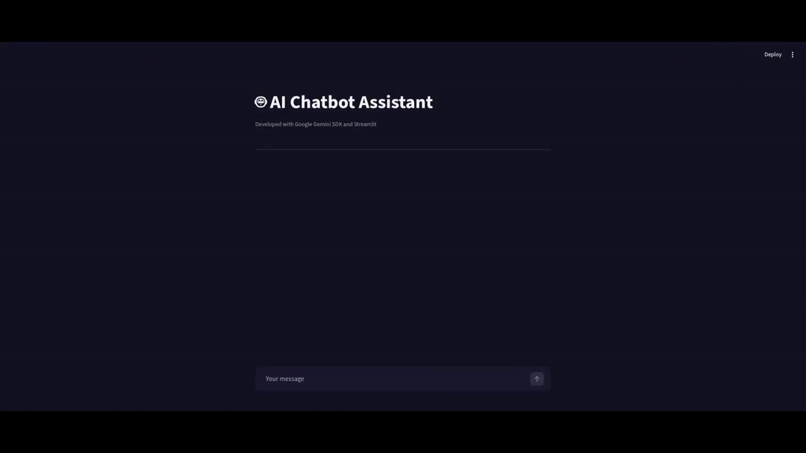
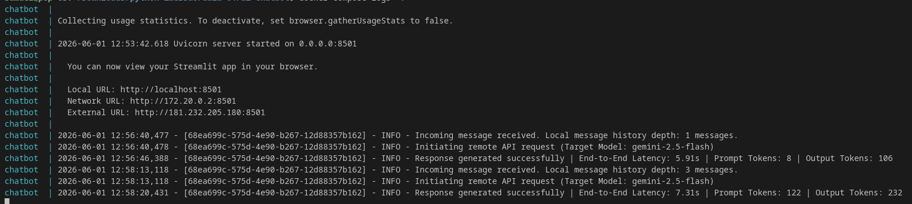

# 🤖 Gemini ChatBot DevOps

This is an intelligent chatbot project leveraging the Google Gemini API with a modern, interactive interface built with Streamlit. It features a native, structured tracking system configured via stdout that automatically injects the Streamlit session_id. This allows for isolated user logs, making it seamless to query and analyze individual sessions using tools like CloudWatch Insights.

---

## 🎥 Video Demo

Watch the application in action below:

<p align="center">
  
</p>

---

## 🛠️ Tech Stack

### Core Application
* **Python 3.11** - Base programming language.
* **Streamlit** - Web framework for rapidly building interactive interfaces.
* **Google GenAI SDK** - Official SDK for integration and communication with the gemini-2.5-flash model.

### Code Quality & Testing
* **PyTest** - Testing framework used for automated unit and integration tests.
* **Ruff** - An extremely fast Python linter and code formatter to ensure compliance with PEP 8 standards.

### Infrastructure & DevOps
* **Docker & Docker Compose** - Containerization of the application to isolate environments within private container networks.
* **GitHub Actions** - Automated CI (Continuous Integration) pipeline executing syntax validation and testing suites on every commit.

---

## 🚀 Local Setup

### Prerequisites

Ensure you have the following installed on your machine:

* [Git](https://git-scm.com/)
* [Docker & Docker Compose](https://www.docker.com/)

### 1. Clone the Repository

```bash
git clone [https://github.com/SamuelDinizTenorio/ai-chatbot](https://github.com/SamuelDinizTenorio/ai-chatbot.git)
cd gemini-chatbot-devops
```

### 2. Configure Environment Variables

Create a .env file in the project root directory with your credentials:

```bash
GEMINI_API_KEY=YourActualGeminiKeyHere
GEMINI_MODEL=gemini-2.5-flash
```

### 3. Spin Up the Environment with Docker Compose

Run the following command to build the image and start the Chatbot container in the background:

```bash
docker compose up --build -d
```

### 4. Access the Application

Open your browser and navigate to:

👉 http://localhost:8501

---

## 🧪 Validating Code Quality

These validations are executed automatically on every push to the repository via GitHub Actions, but you can also run them locally:

Run automated tests:

```bash
pytest
```

Run code quality check and import sorting using Ruff:

```bash
ruff check .
```

---

## 📊 Viewing Application Logs

To monitor the message flow, token metrics, and AI response times in real time, use the native Docker command:

```bash
docker compose logs -f chatbot
```

---

## 📸 Log Output Demo

Below is an example of the structured log output, demonstrating how session IDs, token usage, and latency metrics are formatted in real time:

<p align="center">
  
</p>
